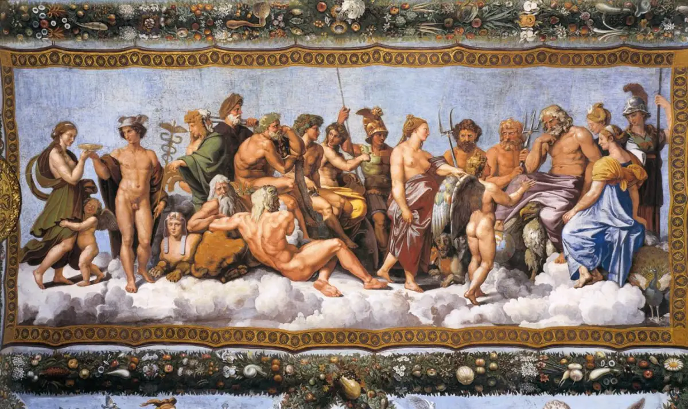
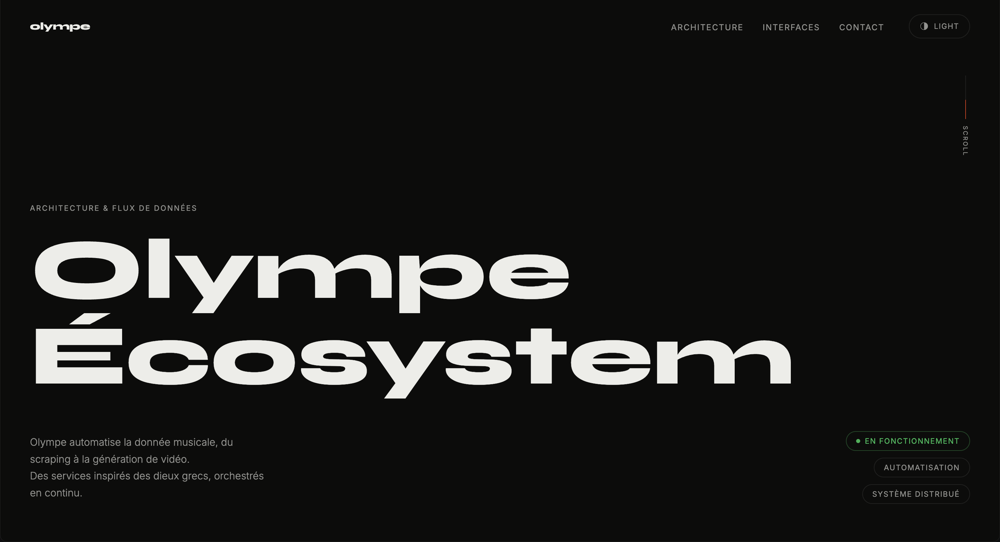
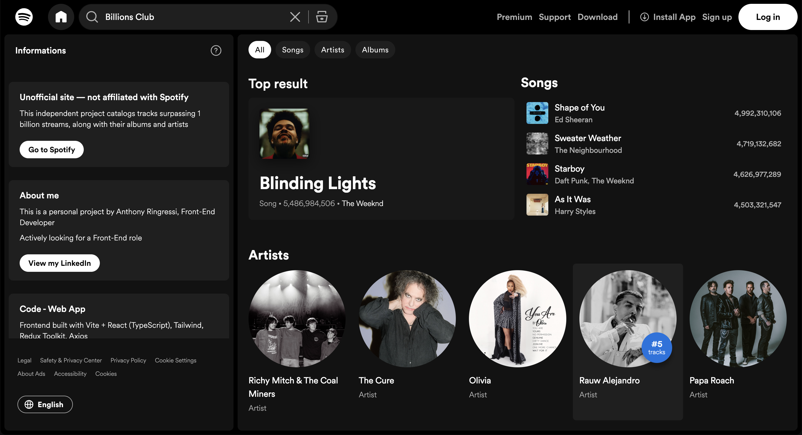

# 🏛️ OLYMPE

**A self-hosted ecosystem of Docker services, each named after a Greek god,**
**that collects, processes, exposes music data, and generates video. All from one stack.**

[Live: spotify-billions.club](https://spotify-billions.club) · [Live: olympe.center](https://olympe.center) · [Live: vexia.studio](https://vexia.studio)

---

### What is Olympe?

Olympe is a personal, modular infrastructure stack: a set of Docker Compose services that can scrape music charts from Spotify, Apple Music and Deezer, store them in PostgreSQL, expose them through an API, and can create automated short-form videos. Different features, same project.
Every service is named after a figure from Greek mythology, matched to its role in the system. Everything runs on a single VPS : named **Atlas**, the titan who holds up the world.

### The Big Picture

Olympe grew step by step toward one ultimate goal: **generating blindtest videos automatically from a Spotify, Apple Music or Deezer URL** (playlist or album)

1. **Artemis** came first : a scraper was needed before anything else could exist.
2. Scraping the _Billions Club_ (songs past 1B streams) was automated to run daily. **Elysium** was built as a side project to put that data to use and make it public. It wasn't the end goal, but it became an important step in its own right.
3. The next big step was generating videos with a fully customizable interface. **Vexia** (Hephaistos) started the same way as a side project to test and use the video-generation tooling being built and grew into a real product along the way.
4. Next up: **short-form blindtest video generation**, coming as a new feature of Vexia.
5. Then: generating a blindtest video directly from a Spotify / Apple Music / Deezer URL, also within Vexia.

### Roadmap

- [x] Scrape music metadata from Spotify, Apple Music & Deezer — Artemis
- [x] Daily automated scrape of the Spotify Billions Club (1B+ streams) — Sisyphe + Heracles + Owl
- [x] Public display of the Billions Club data — Elysium
- [x] Customizable short-form video generation — Vexia / Hephaistos
- [ ] Send success/failure emails during video creation — Vexia
- [ ] Short-form blindtest video generation — Vexia
- [ ] Generate a blindtest video directly from a Spotify / Apple Music / Deezer URL — Vexia

### The Pantheon

| Service      | God / Figure               | Role                                                                 | Status            |
| ------------ | -------------------------- | -------------------------------------------------------------------- | ----------------- |
| **Atlas**    | titan who holds up the sky | The VPS itself — carries the whole stack                             | ✅ Stable         |
| **Caddy**    | —                          | Reverse proxy, automatic HTTPS for every `*.olympe.center` subdomain | ✅ Stable         |
| **Artemis**  | goddess of the hunt        | Scrapes Spotify / Apple Music / Deezer, writes raw JSON              | ✅ Stable         |
| **Owl**      | Athena's owl               | Ingests Artemis' JSON output into PostgreSQL                         | ✅ Stable         |
| **Athena**   | goddess of wisdom          | PostgreSQL — the central datastore                                   | ✅ Stable         |
| **Heracles** | hero of the twelve labors  | Runs heavy scripts and scheduled jobs                                | ✅ Stable         |
| **Sisyphe**  | doomed to repeat his task  | Cron scheduler, periodically triggers Heracles                       | ✅ Stable         |
| **Hermes**   | messenger of the gods      | FastAPI service exposing data to the public                          | ✅ Stable         |
| **Orphee**   | enchanting musician        | Video generation API (yt-dlp + ffmpeg + Claude)                      | 🚧 In development |

### Sites

<table>
<tr>
<td width="33%" valign="top">

**[olympe.center](https://olympe.center)**
 
✅ Stable

Showcase site documenting the full Olympe architecture.

</td>
<td width="33%" valign="top">

**[spotify-billions.club](https://spotify-billions.club)**
 
✅ Stable

Every song that has crossed 1 billion Spotify streams, with album and artist (refreshed nightly)

</td>
<td width="33%" valign="top">

**[vexia.studio](https://vexia.studio)**
 
🚧 In development

Create short-form vertical video clips from YouTube sources with custom text overlays.

</td>
</tr>
</table>

### Repositories

| Repo                                                                   | Description                                                                                                         | Stack                                  |
| ---------------------------------------------------------------------- | ------------------------------------------------------------------------------------------------------------------- | -------------------------------------- |
| [**olympe**](https://github.com/olympe-org/olympe)                     | Central orchestration monorepo: `docker-compose.yml`, Caddy config, and most backend services                       | Python · FastAPI · PostgreSQL · Docker |
| [**artemis**](https://github.com/olympe-org/artemis)                   | Standalone Playwright scraper for Spotify / Apple Music / Deezer metadata                                           | Python · Playwright                    |
| [**elysium**](https://github.com/olympe-org/elysium)                   | Public web app listing every song with 1B+ Spotify streams — [spotify-billions.club](https://spotify-billions.club) | React · TypeScript · Vite · Tailwind   |
| [**olympe-ecosystem**](https://github.com/olympe-org/olympe-ecosystem) | Showcase site documenting the whole architecture — [olympe.center](https://olympe.center)                           | React · Vite · Tailwind                |
| [**hephaistos**](https://github.com/olympe-org/hephaistos)             | Frontend for Vexia Studio, a short-form video creation tool — [vexia.studio](https://vexia.studio)                  | React · TypeScript · Redux Toolkit     |
| [**ambrosia**](https://github.com/olympe-org/ambrosia)                 | Chrome extension bridging YouTube auth cookies to authorized dashboards — built to work around YouTube blocking Vexia's access. [Chrome Web Store](https://chromewebstore.google.com/detail/ambrosia/jpabbbaemgkidilifjlfdnpniphihgle) _(deprecated)_ | Chrome Manifest V3                     |

### Author

Built and maintained solo by [**@anthony-rgs**](https://github.com/anthony-rgs).

---

_Built on Olympus. Deployed on a single VPS._

